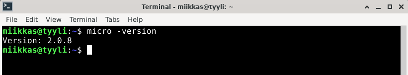
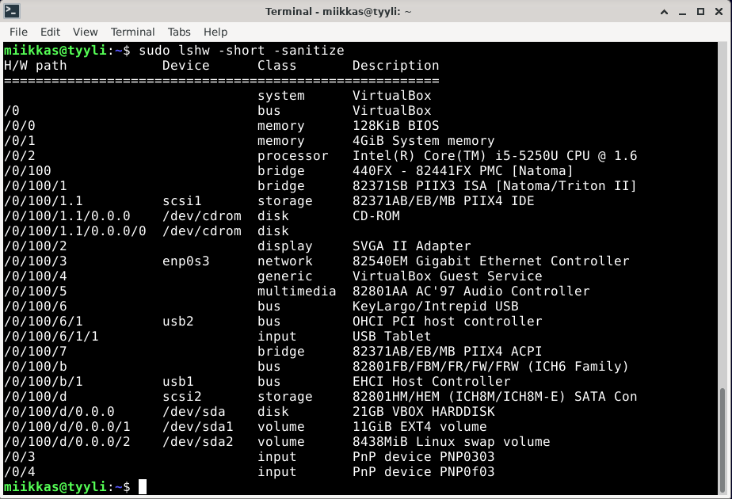

# h2 Tehtävä

    x) Lue ja tiivistä (Muutama ranskalainen viiva riittää. Tässä alakohdassa ei tarvitse tehdä testejä tietokoneella)
        Karvinen 2020: Command line basics revisited (nämä komennot ja hakemistot kannattaa myös opiskella ulkoa ja harjoitella automaatiotasolle)
    a) Micro. Asenna micro-editori
    b) Rauta. Listaa testaamasi koneen rauta (‘sudo lshw -short -sanitize’). Asenna lshw tarvittaessa. Selitä ja analysoi listaus.
    c) Apt. Asenna kolme itsellesi uutta komentoriviohjelmaa. Kokeile kutakin ohjelmaa sen pääasiallisessa käyttötarkoituksessa. Ota ruutukaappaus. Kaikki terminaaliohjelmat kelpaavat, TUI (text user interface) ja CLI (command line interface). Osaatko tehdä apt-get komennon, joka asentaa nämä kolme ohjelmaa kerralla?
    d) FHS. Esittele kansiot, jotka on listattu "Command Line Basics Revisited" kappaleessa "Important directories". Näytä kuvaava esimerkki kunkin tärkeän kansion sisältämästä tiedostosta tai kansiosta. Jos kyseessä on tiedosto, näytä siitä kuvaava esimerkkirivi. Työskentele komentokehotteessa ja näytä komennot, joilla etsit esimerkit.
    e) The Friendly M. Näytä 2-3 kuvaavaa esimerkkiä grep-komennon käytöstä. Ohjeita löytyy 'man grep' ja tietysti verkosta.

- a) Micro-editorin asennettu versio.

- b) Syötin komentokehotteeseen 

        $ sudo lshw -short -sanitize.
        
     komento johti "sudo: lshw: command not found".
     
     Asensin lshw:n 
     
        $ sudo lshw apt-get -y install lshw

