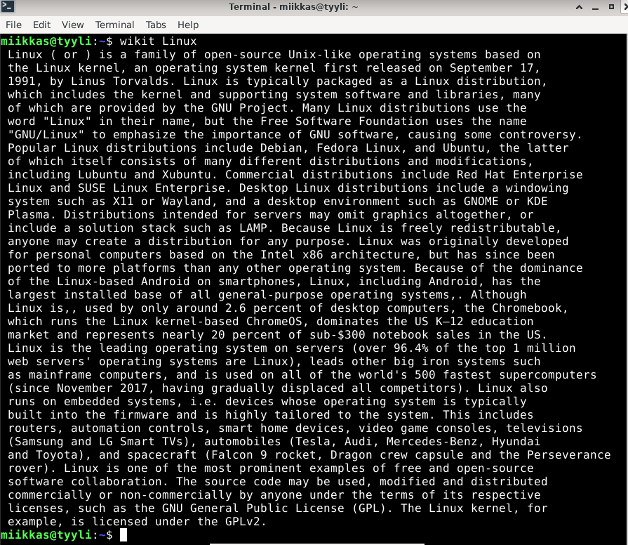

# h2 Tehtävä

    x) Lue ja tiivistä (Muutama ranskalainen viiva riittää. Tässä alakohdassa ei tarvitse tehdä testejä tietokoneella)
        Karvinen 2020: Command line basics revisited (nämä komennot ja hakemistot kannattaa myös opiskella ulkoa ja harjoitella automaatiotasolle)
    a) Micro. Asenna micro-editori
    b) Rauta. Listaa testaamasi koneen rauta (‘sudo lshw -short -sanitize’). Asenna lshw tarvittaessa. Selitä ja analysoi listaus.
    c) Apt. Asenna kolme itsellesi uutta komentoriviohjelmaa. Kokeile kutakin ohjelmaa sen pääasiallisessa käyttötarkoituksessa. Ota ruutukaappaus. Kaikki terminaaliohjelmat kelpaavat, TUI (text user interface) ja CLI (command line interface). Osaatko tehdä apt-get komennon, joka asentaa nämä kolme ohjelmaa kerralla?
    d) FHS. Esittele kansiot, jotka on listattu "Command Line Basics Revisited" kappaleessa "Important directories". Näytä kuvaava esimerkki kunkin tärkeän kansion sisältämästä tiedostosta tai kansiosta. Jos kyseessä on tiedosto, näytä siitä kuvaava esimerkkirivi. Työskentele komentokehotteessa ja näytä komennot, joilla etsit esimerkit.
    e) The Friendly M. Näytä 2-3 kuvaavaa esimerkkiä grep-komennon käytöstä. Ohjeita löytyy 'man grep' ja tietysti verkosta.

## A)

Micro-editorin asennettu versio.

## B)

Syötin komentokehotteeseen 

        $ sudo lshw -short -sanitize.
        
komento johti "sudo: lshw: command not found".
     
Asensin lshw:n 
     
        $ sudo lshw apt-get -y install lshw
     
     Suoritin aikaisemman komennon asennuksen jälkeen uudelleen, joilloin komentokehotteeseen tuli seuraava lista.

Komento lshw eli (List hardware), raportoi minulle listan järjestelmän eri laitteistokomponenteista. Listan informaatio on jaoteltu taulukkoon, jossa informaatio on jaoteltu rivittäin 4 otsikon alle, jotka ovat HardWare path/Device/Class/Description. Taulukon tiedoista löytyy esimerkiksi tietoja virtuaalikoneen sekä läppärini muistista, läppärini prosessorista sekä sen nopeudesta, koneen emolevystä, virtuaalikoneen laiteohjelmistosta, jne. Ilman "-short" ja "-sanitize" komentoa lshw listasi laitteistokomponenttien tiedot paljon laajemmin, sisältäen myös arkaluonteisia tietoja komponenteista. Ilmeisesti "-short" järjestää raportin käytännölliseen taulukkoon ja "-sanitize" jättää pois arkaluonteisen datan.

## c) 

Etsin verkosta erilaisia mielenkiintoisia komentoriviohjelmia. Valitsin seuraavat ohjelmat:

### Wikit

Wikit komentoriviohjelmalla pystyy hakemaan wikipediasta tietoja Linuxin komentokehotteessa. Wikit:n asennusta, sekä toimimista varten piti asentaa myös nodejs sekä npm. Asensin ne, jonka jälkeen asensin Wikit:n.

        $ sudo apt-get -y install nodejs npm
        $ sudo apt-get -y install wikit

Hakeminen komentokehotteessa tapahtuu lisäämällä wikit alkuun, jonka jälkeen laitetaan hakusana, esimerkiksi näin:
        $ wikit Linux

### CMatrix

CMatrix komentoriviohjelma vaikutti hauskalta, joten päätin testata sitä. Asensin sen komennolla:
        $ sudo apt-get -y install cmatrix
Asennuksen jälkeen katsoin mitä CMatrixilla voi tehdä syöttämällä komennon 
        $ cmatrix -help
Komentokehotteeseen avautui lista toiminnoista.

Päätin kokeilla "cmatrix -r" eli rainbow mode. Alla ruutukaappaus, komentokehotteesta komennon jälkeen. Komento avasi "The Matrix" animaation.

!Add file: CMatrix list](cmatrix.png)

### Figlet
        $ sudo apt-get -y install figlet

Kolmantena ohjelmana asensin Figlet:n. Figlet on komentoriviohjelma, joka muuttaa käyttäjän syöttämät tiedot ASCII-bannereiksi. 

Figlet toimii komentokehotteessa esimerkiksi syöttämällä komennon:

        $ figlet "Hello World"

## D)

Verkkosivulla https://terokarvinen.com/2020/command-line-basics-revisited/?fromSearch=command%20line%20basics%20revisited.(Karvinen Tero, 2020-02-03) kappaleessa "Important directories" on esiteltynä tärkeitä kansioita.

### /

/ eli root(juurihakemisto) on koko tiedostojärjestelmän ylin osa. Root sisältää tiedostojärjestelmän kaikki hakemistot. / (root) hakemisto sisältää esimerkiksi /usr kansion, joka sisältää käyttäjiin liittyvät ohjelmat.

lisää kuva 

## /home/

/home/ kansio sisältää kaikkien käyttäjien kotihakemistot. Virtuaalikoneessani on vain yksi eli oma käyttäjäni, hakemisto vie minut oman käyttäjäni kotihakemistoon.

lisää kuva

## /home/miikkas

/home/miikkas on käyttäjäni kotihakemisto. Tämä hakemisto on ainoa paikka, jossa nimenomaan käyttäjälläni "miikkas" voi tallentaa tietoja pysyvästi.
Hakemistosta löytyy esimerkiksi käyttäjäni tiedostot(Documents).

lisää kuva

## /etc/

/etc/ kansio sisältää kaikki järjestelmän asetukset. Asetukset ovat luettavissa tekstitiedostoina. /etc/ löytyy root hakemiston alta, sillä sen edessä on vain / eli root hakemiston merkki. Avasin esimerkiksi /etc/ hakemistosta "os-release" tiedoston.

lisää kuva

## /media/

/media/ sisältää poistettavissa olevat mediat. /media kansiossa oli vain oman käyttäjäni kansio, joka oli tyhjä, mutta media kansiossa voisi olla esimerkiksi usb muistitikun mediat.

lisää kuva

## /var/log/

/var/log/ hakemistosta löytyvät koko järjestelmän lokit. Avasin esimerkiksi lokeista boot lokin syöttämällä komennon " $ sudo cat boot.log". Lokista näkee mitä bootin aikana on tapahtunut. 

lisää kuva

## E)

grep komento etsii annetusta tiedostosta rivejä, jotka sisältävät osuman annetuihin hakusanoihin tai merkkeihin. 

Esimerkkejä:

Ensimmäisessä esimerkissä etsin grep komennon avulla /etc/passwd tiedostoa käyttäjälleni "miikkas"

Komento:
        $ grep miikkas /etc/passwd

kuva

Tässä etsin grep komennolla /etc/ hakemistosta kaikista tiedostoista merkkijonoa "192.168.1.50"
Komento:
        $ sudo grep -r "192.168.1.50" /etc/
        
 kuva
